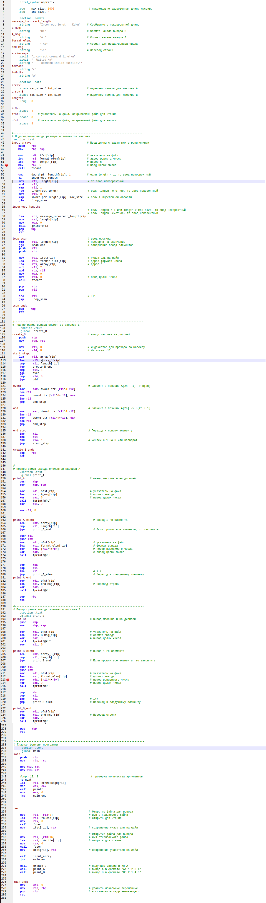

# Первое домашнее задание по архитектуре вычислительных систем
## Фирсов Федор БПИ219 Вариант 24

Сформировать массив B из элементов массива A поменяв местами
элементы, стоящие на чётных и нечётных местах:
A 0<-> A1; A2 <-> A3 ...

### Написание
Для начала я написал решение на С его можно посмотреть в файле [data.c](data.c).

После этого я скомпилировал код с помощью команд: 

Как видно программа собирается и корректно работает на тесте.

Посмотрев файл data.s я понял, что он огромный и в нем сложно разобраться)
Поэтому я приступил к созданию своей программы на ассемблере. 
С ней можно ознакомиться в файле [my_sol.s](my_sol.s). 
Этот код я тоже собрал и запустил

Как видно программа также собирается и корректно работает на тесте.

Для соответсвия требованиям я переписал код на Си используя функции. Новый код можно посмотреть в файле [sec_data.c](sec_data.c).
Он также собрался без проблем.

Для выполнения следующего пункта я переписал свой ассемблерный код из [my_sol.s](my_sol.s) с использованием подпрограмм.
Новый код доступен в файле [my_sol_sec.s](my_sol_sec.s). Был собран в консоли:

Для достижения задач пункта на оценку 7 я написал новую версию программы с файловым вводом выводом в файле [my_sol_thi.s](my_sol_thi.s)
имена файлов передаются в качестве аргмументов командной строки. Пример входных и выходных данных лежат в [in.txt](in.txt) и [out.txt](out.txt).

#### Таким образом получен финальный код - [my_sol_thi.s](my_sol_thi.s)
Или вот (снизу еще тестирование!)

### Тестирование

Немного про время работы. Сравним время работы [my_sol_sec.s](my_sol_sec.s), как лучшего рукописного кода и [sec_data.c](sec_data.c) как лучшего кода полученного из Си. Очевидно сами эдементы массива не влияют на время работы. Так что протестируем указывая только размер:
Так как на маленьких N все плохо видно увеличим max_size до 1000. Также я усреднил время 10 звпусков для каждого теста.

Как видно разница всегда +- константна. Так что писание рукописного кода с одной стороны дает преимущество, а с другой стороны на огромных тестах разниуа будет не столь значительна.
