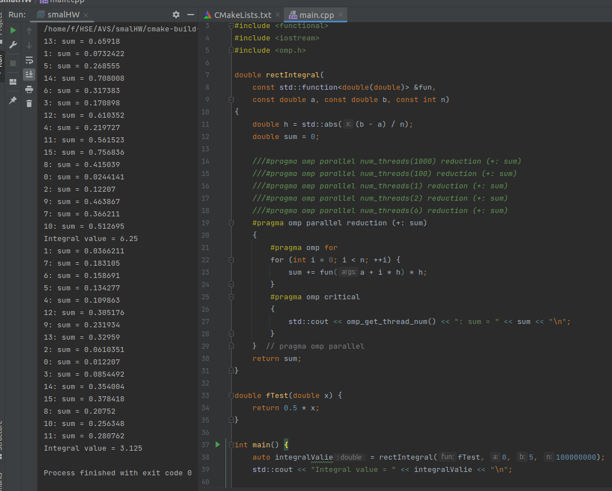
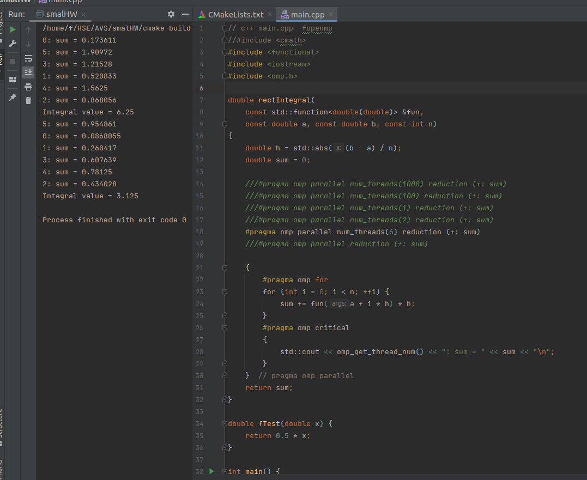

# Домашнее задание по архитектуре вычислительных систем на 28.11
## Фирсов Федор БПИ219

Я запустил код нахождения интеграла с разными директивами:

Как видно при изменении колличество потоков оно меняется и при меньшем числе потоков ответ все тот-же, но находиться чуть дольше.
  

Если убрать изолированность потоков, то увидим, что они все обновляют значение друг друга и получается какой-то бред.

Если сделать сумму приватной, то каждый пото посчитает правильный ответ, но так как сумма приватна, то не получится посчитать финальный ответ.

